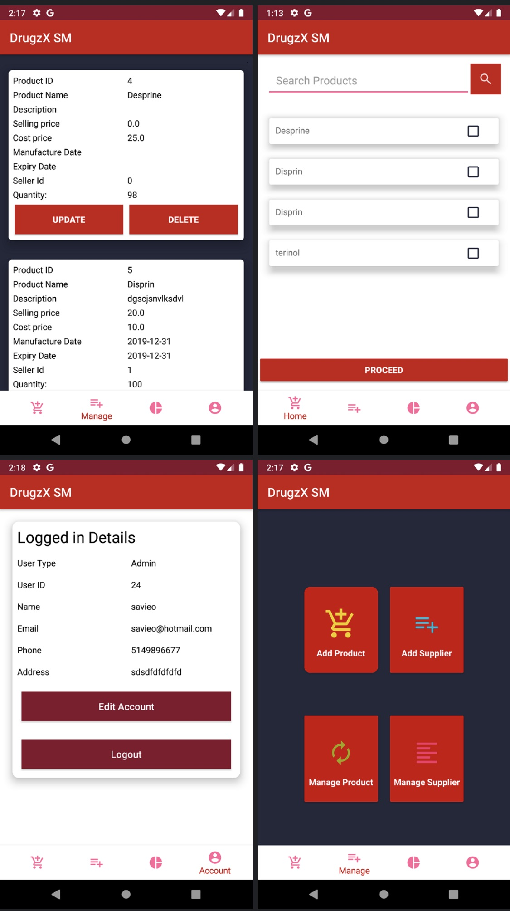

# pharmacy-management-system
Project which includes two modules web application module developed with Spring Boot , React , MYSQL and Android mobile application module developed with KOTLIN &amp; XML 
It is a Pharmacy management solution ,The mobile implementation has two applications,one is the DrugzX for the Pharmacist and another is DrugzX SM for the Stock Manager.
Following images will give a quick look at some of it's features

